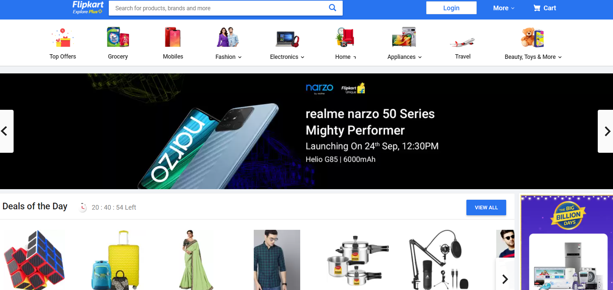

# flipkart-clone

### V1.0

This version uses JSON object for items in card which is filed dynamically with json data

#### FEATURES

 <ol>
  <li>Items can be added to cart</li>
  <li>check out page shows item derscription</li>
  <li>carousal for items</li>
  <li>Timer for upcoming events</li>
  <li>search bar for item search<li>
